# Tic Tac Toe

- Tic Tac Toe is a simple game in which the user and the computer alternately put Xs and Os in a three by three grid. Not only is this a fun game but it also helps people to improve their logical thinking and strategy skills. The objective of the game is to let you play tic tac toe without having to waste paper. 
        
- How to play:
    1. You choose a square between 1-9 from the empty squares.
    2. You are X, the computer  is O. You take turns with the computer putting marks in empty squares.
    3. The first player to get 3 of her marks in a row (up, down, across, or diagonally) is the winner and gets a point.
    4. When all 9 squares are full, the game is over. If no player has 3 marks in a row, the game ends in a tie.

Live link to the deployed app: https://tictac--toe.herokuapp.com/ 

### Features

    
<strong>Welcome Header:</strong>

    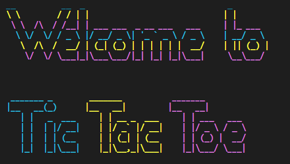

- The welcome message is large and clear to greet the users when they first load the game 
- It was created with [ASCII Text Generator](http://patorjk.com/software/taag/#p=display&f=Fun%20Face&t=daxzxczxxz).

    
<strong>Rules Info:</strong>

    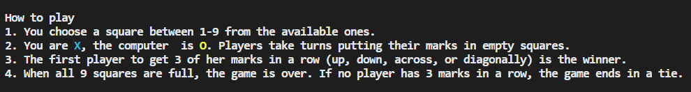

- The rules define and explain how the game is played with 4 steps. 
- It gives the users a clear understanding of the game play.

    
<strong>Game Board</strong>

    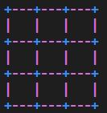

- The board is a three by three grid where the actual game is played. 
- '-', '+', and '|' have been used to clearly depict the squares.

    
<strong> Invalid Inputs :</strong>

    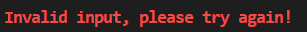 
    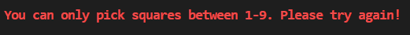 
    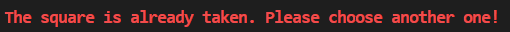 
    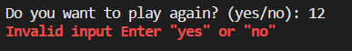

- Clear invalid messages are displayed when the user enters invalid input. 
- It explains to the user specifically what went wrong with their input and requests that they try again.

    
<strong>Winning\tie message and score board</strong>

    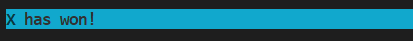 
    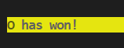 
    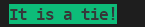 
    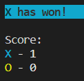

- If any of the players win the game, the winning message is displayed after each game, and if there is a tie, the tie message is presented. 
- The score board displays how many times each player has won the game. 
- The scoreboard displays the user's progress, and the winning message makes it apparent if someone has won or if it is a tie.

    
<strong>Play again and change the difficulty level</strong>

    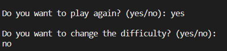

- The user is prompted to indicate whether they would like to play again after each game by answering "yes" or "no." 
- If the user answers "yes," another question follows, giving them the option to alter the game's difficulty. 
- If they user answers ‘no’ an exit message is displayed and the program stops running

    
<strong>New game header</strong>

    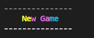

- The new game header is displayed to show where the next game has started if the user decided to play again after each game.

### Future Features
- Online players
    * A future feature that could potentially be implemented is an online server where players from the different devices could play against each other.
- A smarter version of the computer player
    * There are currently two levels of difficulty where a square is randomly selected by the computer. Even though there is less randomness in the medium difficulty level, winning is still incredibly simple. To make it more difficult to win, a smarter computer opponent could be used.

### Data model and structure
The python files that were created within the application are:
- players.py
    * This file defines the player classes where there is a user player and computer player class. 
    * This module holds the logic behind the player's selection of squares.
- run.py
    * This module is where the Tic Tac Toe game is defined. The main function that runs the game is also in this module.
    * The game's logic and the program flow are both contained in this module.
- visuals.py
    * The print messages and terminal color schemes are located in this module.
    * This file solely contains static print messages and has no logic.

    
<strong>Flowchart</strong>

    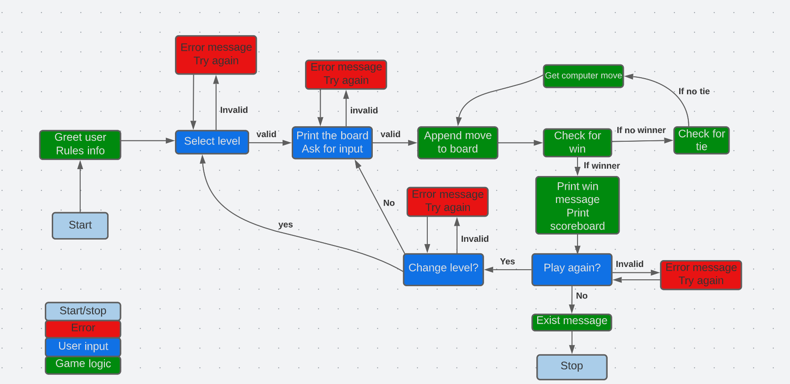

### Testing
The following bugs were discovered during the testing of the game:

- **Bug:** The computer's letter would take precedence over the player's if it created a number that the player had already claimed.
- **Fix:**  Instead of using the moves returned by the available_moves method, a separate list called available_squares was created, from which the computer selects a square at random. Each player's move is taken off the list every time they make one.
  

- **Bug:** The player did not win when the diagonal win combination of 3, 5, and 7 was filled in the board.
- **Fix:**  It was found that the variable 'j', which was also the name of the counting variable in the outer loop, was used in the nested for loop in the check_for_win method. The issue was resolved by replacing it with "k."
  

- **Bug:**  If the computer won a game, without any further action from the players, it also won the following game too.
- **Fix:**  In order to determine whether there was a winner, an if-else statement was added to the main function. If there was, the while loop iteration was then skipped by the ‘continued’ statement .

#### Unfixed bugs
No known bugs exist in the deployed application.

### Validator testing
Every file was examined using the built-in pep8 validator in "gitpod." There were multiple "line too long" warnings in the visuals.py file, but as the file only provided messages for the terminal and no logic, it was left unchanged. Apart from that, the files were error-free. 
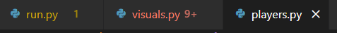

### Development
- **Languages**
    * [Python](https://www.python.org/)
    * [HTML](https://www.w3schools.com/html/html_intro.asp) - was included in the Code Institute template.  
    * [CSS](https://www.w3schools.com/css/css_intro.asp) - was included in the Code Institute template.
    * [Javascript](https://www.javascript.com/)- was included in the Code Institute template.
- **Imported Modules**
    * Random- was used to randomly choose a list item
- **Tools and resources**
    * VS Code - all the code in the application were written in VS Code
    * Gitpod -  was used to send the application saves to github
    * Github - was used to save and hold the application
    * Heroluapp  - was used to deploy the application

### Deployment
1. Go to heroku.com
2. Click the new button and select 'create new app'
3. Enter an app name and select region
4. Click 'create'
5. Go to settings and add a config var with the key 'PORT' and value '8000'
6. Add python buildpack
7. Add nodejs buildpack
8. Go to deploy and connect to the github repository
7. Select "Enable Automatic Deploys" and click '¨Deploy Branch'

### Credits
- Content
    * The code for the colors was taken from: https://gist.github.com/richardbwest/17674f84961e975d47cf106da9728dd2 
    * The code for the get_valid_medium_computer_move method was taken but modified from: https://codereview.stackexchange.com/questions/83324/optimizing-a-tic-tac-toe-ai 

- Media
    * The flowchart was created using [Lucid](https://lucid.app/documents#/dashboard?folder_id=home)
    * Colors were added from: https://www.lihaoyi.com/post/BuildyourownCommandLinewithANSIescapecodes.html 
